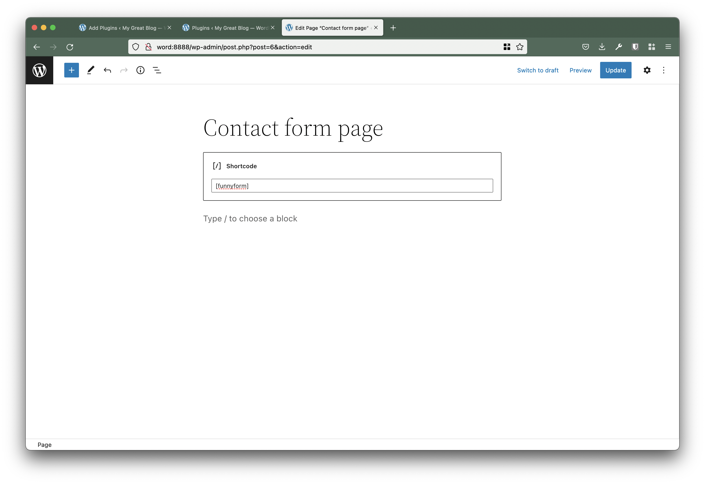
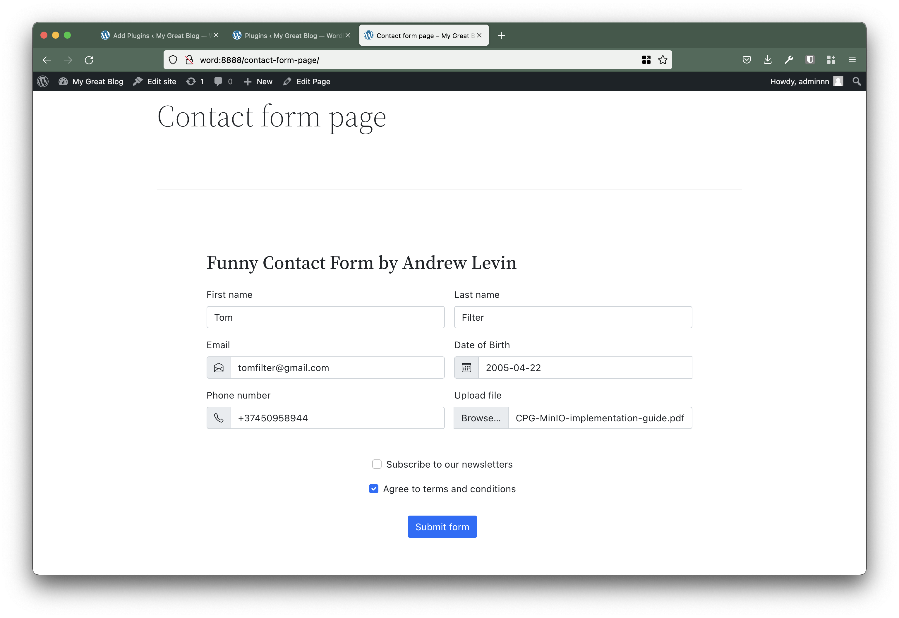
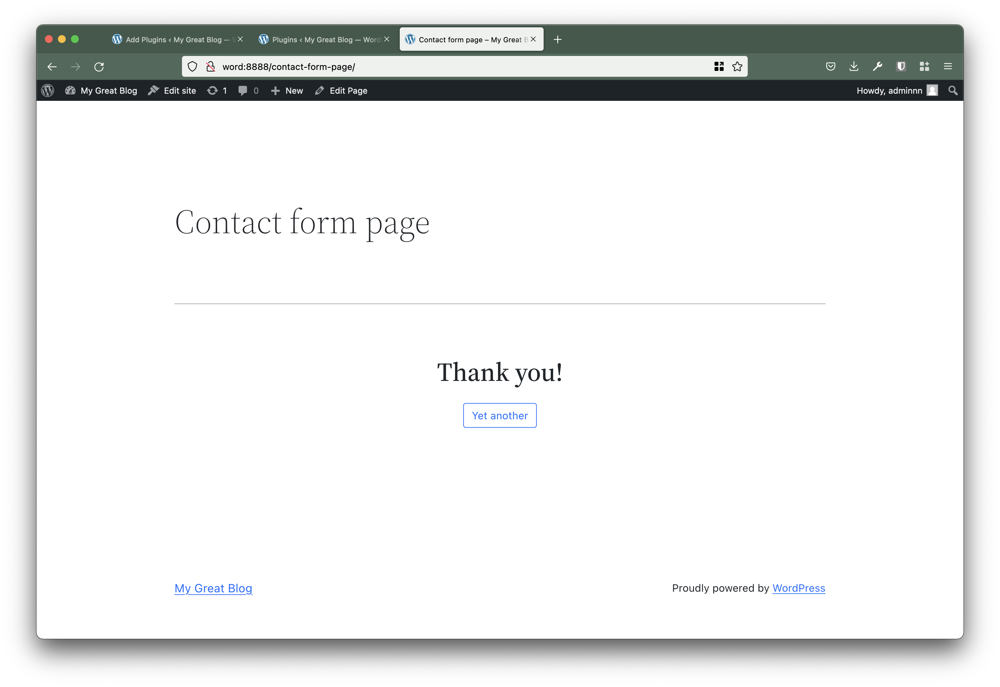
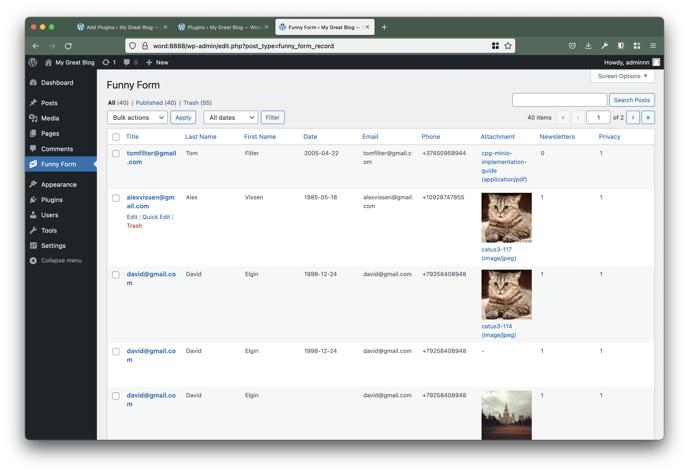

This is a simple Wordpress plugin "Funny Form" - a small Contact Form which was developed by Andrey Levin.

## Install


### Step 1
You can install this plugin via uploading ZIP [**funnyform.zip**](funnyform.zip) archive into your WP plugins's list funnyform.zip


### Step 2

Add shortcode inside any WP page or post content.

```
[funnyform]
```



## Plugin Description

Main contact of this plugin is stored into **funnyform** folder.
img-form-1

#### Additional extensions used in this plugin

- Bootsrap (https://getbootstrap.com/docs/5.1/getting-started/download/)
- Bootsrap icons (https://icons.getbootstrap.com/)
- Date Picker (https://www.npmjs.com/package/date-of-birth-js)






### List of items in the WP admin page 




